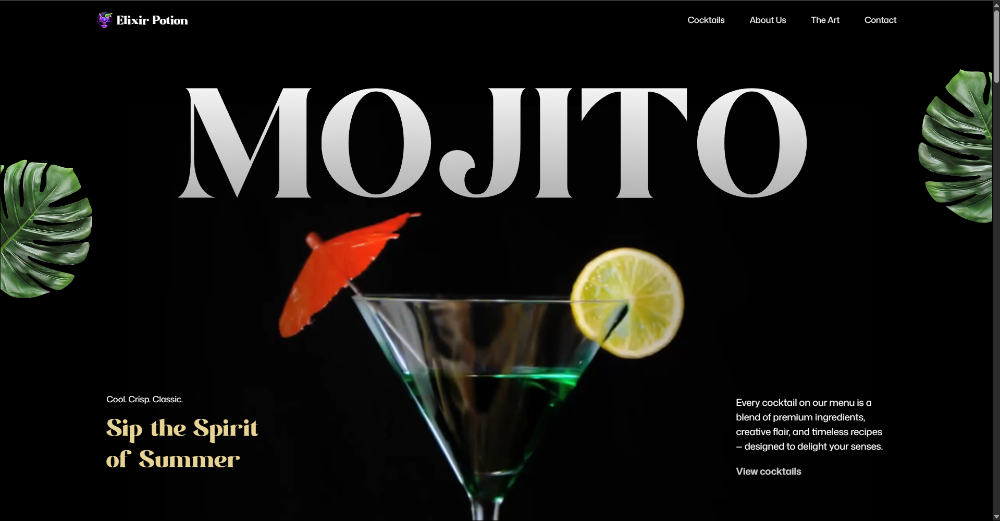

# <div align="center" size="48px">🍸 ElixirPotion</div>
<div align="center">
<p>Premium cocktail website with stunning GSAP animations and modern React development</p>

[](https://elixir-potion-lac.vercel.app/)
[](https://react.dev/)
[](https://gsap.com/)
[](https://tailwindcss.com/)
[](https://vitejs.dev/)
</div>

<p align="center">
  
</p>

## 🌟 Overview

ElixirPotion is a cutting-edge cocktail website that combines the art of mixology with modern web technologies. Built with React and powered by GSAP (GreenSock Animation Platform), this project delivers a cinematic browsing experience with scroll-triggered effects, parallax scrolling, and dynamic text reveals.

Perfect for cocktail bars, beverage brands, and mixology enthusiasts looking to create an unforgettable online presence.

## ✨ Key Features

- 🎬 **SplitText Animations** - Dynamic text reveals with character-by-character effects
- 📜 **ScrollTrigger Effects** - Scroll-based timeline control and animation triggers
- 🌊 **Parallax Scrolling** - Immersive depth effects that respond to user interaction
- 📌 **Pinned Sections** - Sections that lock in view while content animates
- 🎥 **Scroll-Synced Video** - Video playback synchronized with scroll position
- 🖼️ **Image Masking Effects** - Scroll-triggered pins and masks for striking transitions
- 🎠 **Custom Carousel** - Fully customized carousel with multiple navigation options
- ⏱️ **Seamless Timelines** - Smooth animation sequences spanning multiple sections
- 📱 **Fully Responsive** - Optimized for all devices and screen sizes

## 🛠️ Technology Stack

### Core Technologies
- **React 18** - Modern React with hooks and functional components
- **GSAP 3.12** - Professional-grade animation library
- **Tailwind CSS 3** - Utility-first CSS framework
- **Vite 5** - Lightning-fast build tool and development server

### Animation Libraries
- **GSAP ScrollTrigger** - Scroll-based animation control
- **GSAP SplitText** - Advanced text animation effects
- **GSAP MotionPath** - Complex motion animations
- **GSAP TextPlugin** - Dynamic text manipulation

### Development Tools
- **JavaScript ES6+** - Modern JavaScript features
- **PostCSS** - CSS processing and optimization
- **ESLint** - Code linting and formatting

## 🎭 Animation Highlights

The platform features cutting-edge animations powered by GSAP:

- **Text Reveals** - Character-by-character animations with staggered timing
- **Scroll Interactions** - Trigger animations based on scroll position
- **Parallax Effects** - Multi-layer depth movement
- **Video Sync** - Progress-based video control
- **Image Transitions** - Smooth reveal and masking effects
- **Timeline Coordination** - Synchronized multi-element animations

## 📐 Architecture

ElixirPotion follows a modern React architecture:

- **Component-Based** - Modular, reusable components
- **Hook-Driven** - Custom hooks for animation logic
- **Performance Optimized** - Lazy loading and efficient rendering
- **Mobile-First** - Responsive design principles

## 🎨 Components

- **Hero Section** - Dynamic landing area with animated cocktail elements
- **About Section** - Story-driven content with parallax backgrounds
- **Menu Showcase** - Interactive cocktail displays with hover effects
- **Video Gallery** - Scroll-synced video presentations
- **Testimonials** - Customer reviews with smooth transitions
- **Contact Form** - Animated form with validation feedback
- **Navigation** - Smooth scrolling navigation with active states
- **Custom Carousel** - Multi-directional slide animations

## 🚀 Getting Started

### Prerequisites

Ensure you have the following installed:
- **Node.js** (v16 or higher)
- **npm** or **yarn** package manager
- **Git** for version control

### Installation

1. **Clone the repository**
   ```bash
   git clone https://github.com/Demigod1410/ElixirPotion.git
   cd ElixirPotion
   ```

2. **Install dependencies**
   ```bash
   npm install
   # or
   yarn install
   ```

3. **Start the development server**
   ```bash
   npm run dev
   # or
   yarn dev
   ```

4. **Open your browser**
   Navigate to `http://localhost:5173` to view the project

### Build Commands

```bash
# Development server
npm run dev

# Production build
npm run build

# Preview production build
npm run preview

# Lint code
npm run lint
```

## 📁 Project Structure

```
ElixirPotion/
├── public/
│   ├── assets/
│   │   ├── images/          # Cocktail and UI images
│   │   ├── videos/          # Background and showcase videos
│   │   └── icons/           # SVG icons and graphics
│   └── readme/              # Documentation assets
├── src/
│   ├── components/
│   │   ├── sections/        # Main page sections
│   │   ├── ui/              # Reusable UI components
│   │   ├── animations/      # GSAP animation components
│   │   └── layout/          # Layout components
│   ├── hooks/
│   │   ├── useGSAP.js      # GSAP integration hook
│   │   ├── useScroll.js    # Scroll utilities
│   │   └── useResponsive.js # Responsive utilities
│   ├── utils/
│   │   ├── animations.js   # Animation helpers
│   │   ├── constants.js    # App constants
│   │   └── helpers.js      # Utility functions
│   ├── styles/
│   │   └── globals.css     # Global styles and Tailwind imports
│   ├── App.jsx             # Main app component
│   └── main.jsx            # App entry point
├── package.json
├── vite.config.js
└── tailwind.config.js
```

## 🎯 Performance Optimizations

- **Lazy Loading** - Images and components load on demand
- **Animation Cleanup** - Proper disposal of GSAP instances
- **Code Splitting** - Dynamic imports for better performance
- **Asset Optimization** - Compressed images and videos
- **Efficient Rendering** - Optimized React component updates

## 🐛 Troubleshooting

### Common Issues

**Animations not working**
- Ensure GSAP is properly installed and registered
- Check browser console for errors
- Verify ScrollTrigger plugin registration

**Performance issues**
- Reduce animation complexity on mobile devices
- Check for memory leaks in animation cleanup
- Optimize large video and image assets

**Build errors**
- Clear `node_modules` and reinstall dependencies
- Verify all GSAP plugins are properly imported
- Check Vite configuration for asset handling


<p align="center">
  <a href="https://github.com/Demigod1410/ElixirPotion">View Project</a> •
  <a href="https://elixir-potion-lac.vercel.app/">Visit ElixirPotion</a> •
  <a href="https://github.com/Demigod1410">GitHub Profile</a> •
  <a href="dakshrana1410@gmail.com">Contact</a>
</p>
